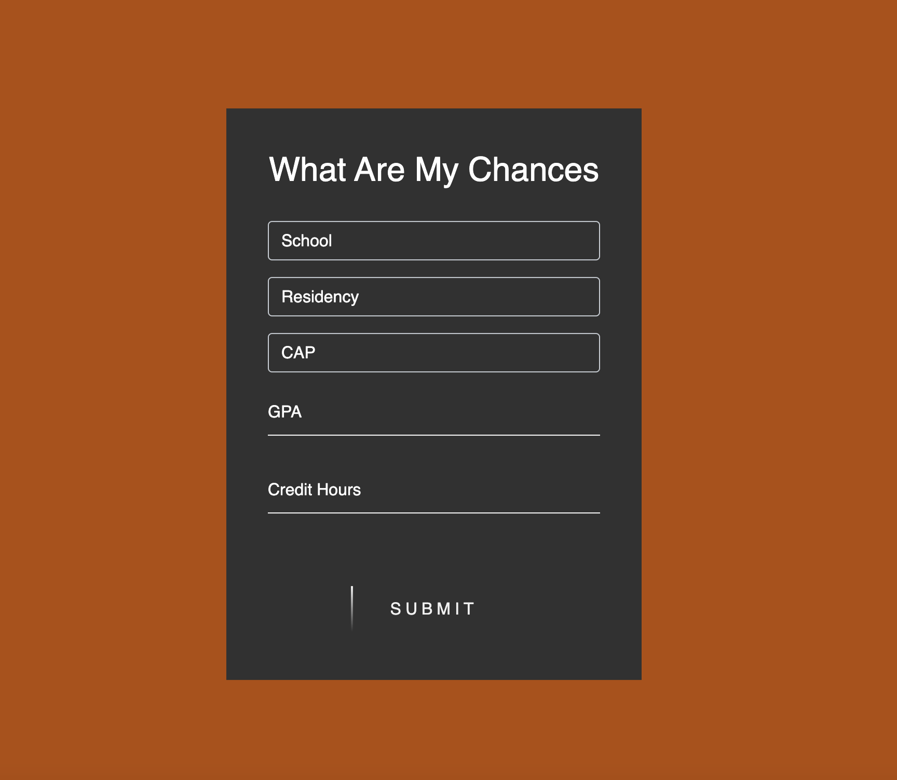

# What-are-my-chances (UT Austin External Transfer)

## Predict your chances of being admitted as an external transfer

### How it works

### Naive Bayes Classifier that predicts a students chances of being accepted based on the following criteria:

- GPA
- College
- Credit Hours
- Residency
- CAP 

### WARNING: This data was found on reddit 

  The data are self reported application decision results from 2020 and 2021 fall semesters. 
  The naive bayes classifier may produce wildly innacurate results since the data it was trained on is:
  - very small (800+)
  - highly skewed
  - Has an inflated acceptance rate 
  
  

  https://www.reddit.com/r/UTAustinAdmissions2/comments/v2gma2/transfer_results_for_2020_and_2021/

## Check out the Jupyter Notebook for the follwing stats:

- Average GPA by College
- Acceptance Rate by College
- Number of Applcations by College
- Entry Submission Dates
- Most Common Majors
- Least Common Majors

## Spin up a simple flask app to input your data

#### Make sure all dependencies are installed 
  pip3 install -r requirements.txt
  
#### Start the server
  python3 app.py
  
#### Paste URL in browser

  usually 127.0.0.1:5000
  
 

  

